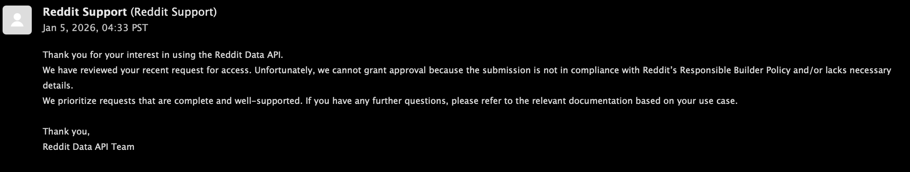
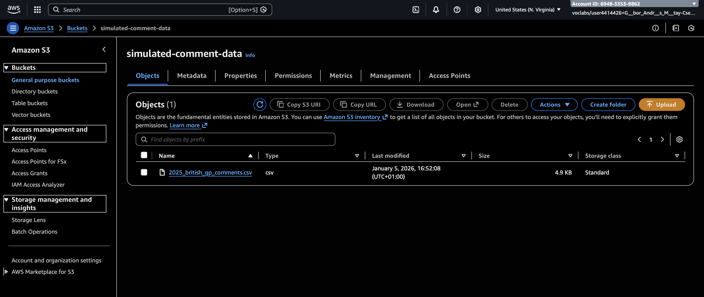
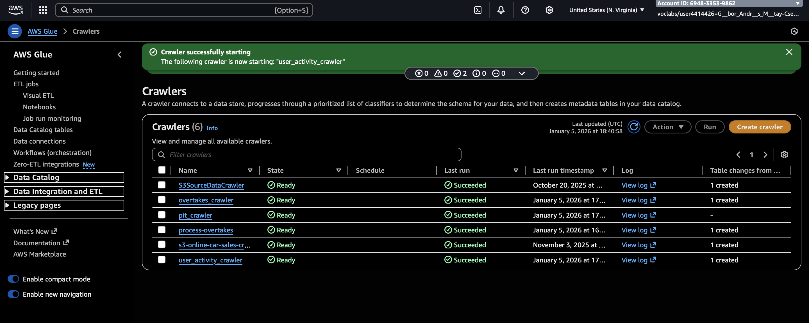
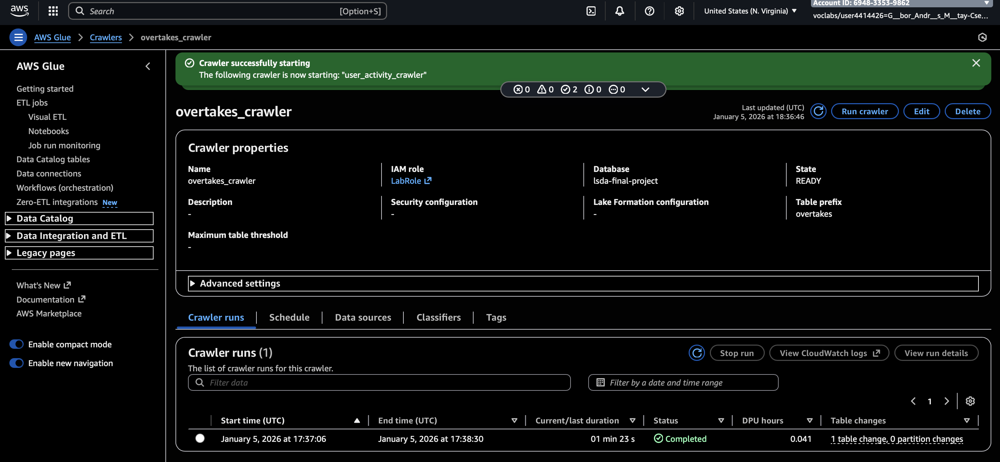
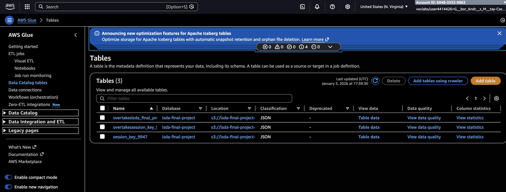

# Implementation of project plan
## Difficulties with the original project plan.
My original plan was to use Reddit API to see when people are commenting below a post made for the race discussion. </br>

I had multiple problems during the exam solution. The first one is that Reddit API is not longer publicly accessible. I requested to get an API key but they refused it. It is a new policy, it was introduced 2 months ago, and when I started the project, I thought I could get access to it. </br> 

My second problem was if I just call the comments from the page writing a plus ```.json``` at the end of the URL, I can only get 66 comments. </br>
After it, I check if I can use other social media platforms, but Twitter API is also not publicly accessible without premium subscription, and I don't have it. And other open platforms like lemmy do not have a large enough Formula 1 community to write posts and comments. </br>
So at the end, I found a solution to simulate data by Google Gemini. I wrote a prompt to generate a table, where is timestamp for every minute, and an integer column with the number of the comments in the given time interval. I wrote some additional informations like my original project plan, and the egzact race and its date. However I will regard this problem as non-existent, since a real business would pay for the company owning the social platform to get access to the data, since it cannot say that they want it for personal use. </br>

My other problem was to call the FastF1 API. Since it is not a REST API (and the project description did not say that it should be a RESTful API), I tried to call the ```fastf1``` library in Python, but it was not succesfull. I tried to save it as a .zip file, and add it as a layer, but I could not solve it, and even cannot use pandas in an AWS Lambda function. </br>
To solve this problem, I went to the OpenF1 API, which is a RESTful API, and I could call it from AWS Lambda without any problem. However its limitation that it do not have any information about the race director's messages (e.g. safety car, yellow or red flags, etc.), so I could not examine the effect of them, just the overtakes and the pit stops. </br>

And I let to see the effect of the weather conditions, because the OpenMeteoAPI is not enough precise to see the real weather changes during the race.

## Read-in data to S3 buckets
I created two S3 buckets, one for the simulated Reddit comments data, and one for the OpenF1. Their names are the following: ```simulated-comment-data``` and ```lsda-final-project-raw```.


For the ```simulated-comment-data``` bucket, I uploaded the CSV file generated by Google Gemini. It contains the timestamp and the number of comments in that minute.


For the ```lsda-final-project-raw``` bucket, I read-in the data from OpenF1 API using AWS Lambda function, and stored it as a json file in the S3 bucket. The Lambda function is the following:
```python
import json
import os
import boto3
from urllib import request, parse

s3 = boto3.client("s3")
BUCKET_NAME = "lsda-final-project-raw"
BASE_URL = "https://api.openf1.org/v1"

DATA_SOURCES = {
    "overtakes": "/overtakes",
    "pit": "/pit"
}

def fetch_data(endpoint: str, session_key: int):
    url = f"{BASE_URL}{endpoint}?session_key={session_key}"
    with request.urlopen(url, timeout=10) as response:
        return json.load(response)

def upload_to_s3(data, source: str, session_key: int):
    key = f"openf1/{source}/session_key={session_key}/data.json"

    # Convert JSON array to newline-delimited JSON
    body = "\n".join(json.dumps(row) for row in data)

    s3.put_object(
        Bucket=BUCKET_NAME,
        Key=key,
        Body=body,
        ContentType="application/json"
    )
    return key

def lambda_handler(event, context):
    session_key = event.get("session_key", 9947)
    uploaded_files = []

    for source, endpoint in DATA_SOURCES.items():
        try:
            data = fetch_data(endpoint, session_key)
            if not data:
                print(f"No data for {source}")
                continue

            key = upload_to_s3(data, source, session_key)
            uploaded_files.append(key)

        except Exception as e:
            print(f"Failed {source}: {e}")

    return {
        "statusCode": 200,
        "session_key": session_key,
        "uploaded_files": uploaded_files
    }
```
The main advantage of this method, it that I can easily extend it to read-in other races, because the session_key is a variable, and AWS saves the results in folders nameing it by the session_key. So if my analysis would include a longer period, than it would be easy to read a database. </br>
It was the part, where I gave up the FastF1 library, and used OpenF1 API instead, because I could not call it within AWS Lambda. Maybe it is my fault, or maybe it is the limitation of the learning environment, I don't know. </br>
And I could use a trigger here, but since the number of the Formula 1 races is relatively low (24 races per year), and the time break between them is not regular, I thought it is not worth to set up a trigger for this. </br>


The uploaded files are in json form like this:
```
{"date": "2025-07-06T14:08:17.475000+00:00", "session_key": 9947, "pit_duration": 28.7, "meeting_key": 1277, "driver_number": 12, "lap_number": 2}
{"date": "2025-07-06T14:16:33.371000+00:00", "session_key": 9947, "pit_duration": 29.1, "meeting_key": 1277, "driver_number": 18, "lap_number": 6}
```
## Process data with AWS Glue
I created three AWS Glue Crawlers to create the tables in the AWS Glue Data Catalog.




In the ```overtakes_crawler``` and in the ```pit_crawler```, I read-in the json data from the ```lsda-final-project-raw``` S3 bucket (from different subfolders), while in the ```user_activity_crawler```, I read-in the CSV data from the ```simulated-comment-data``` S3 bucket. </br>

Thanks to it, I generated three tables in the AWS Glue Data Catalog:


The database is called as ```lsda-final-project```.

## Query data with AWS Athena
I created one query to see the number of the overtakes, pit stops and the comments during the race in 5 minute intervals.
```sql
WITH 
-- 1. Calculate Comment Counts First
comment_stats AS (
    SELECT 
        floor(to_unixtime(CAST(datetime AS TIMESTAMP)) / 300) * 300 as bucket_ts,
        sum(num_of_comments) as total_comments
    FROM "lsda-final-project"."simulated_comment_data"
    GROUP BY 1
),

-- 2. Calculate Pit Counts Separately
pit_stats AS (
    SELECT 
        floor(to_unixtime(from_iso8601_timestamp(date)) / 300) * 300 as bucket_ts,
        count(*) as cnt_pits
    FROM "lsda-final-project"."session_key_9947"
    GROUP BY 1
),

-- 3. Calculate Overtake Counts Separately
overtake_stats AS (
    SELECT 
        floor(to_unixtime(from_iso8601_timestamp(date)) / 300) * 300 as bucket_ts,
        count(*) as cnt_overtakes
    FROM "lsda-final-project"."overtakessession_key_9947"
    GROUP BY 1
)

-- 4. JOIN the pre-calculated totals
SELECT 
    from_unixtime(c.bucket_ts) AS five_min_bucket,
    c.total_comments,
    COALESCE(p.cnt_pits, 0) AS cnt_pits,
    COALESCE(o.cnt_overtakes, 0) AS cnt_overtakes
FROM 
    comment_stats c
LEFT JOIN 
    pit_stats p ON c.bucket_ts = p.bucket_ts
LEFT JOIN 
    overtake_stats o ON c.bucket_ts = o.bucket_ts
ORDER BY 
    1 ASC;
```

Its result is the following:
```
#	five_min_bucket	total_comments	cnt_pits	cnt_overtakes
1	2025-07-06 13:00:00.000	47	0	0
2	2025-07-06 13:05:00.000	53	0	0
3	2025-07-06 13:10:00.000	58	0	0
4	2025-07-06 13:15:00.000	66	0	0
5	2025-07-06 13:20:00.000	83	0	0
6	2025-07-06 13:25:00.000	95	0	0
7	2025-07-06 13:30:00.000	110	0	0
8	2025-07-06 13:35:00.000	126	0	0
9	2025-07-06 13:40:00.000	133	0	0
10	2025-07-06 13:45:00.000	147	0	0
11	2025-07-06 13:50:00.000	298	0	0
12	2025-07-06 13:55:00.000	636	0	0
13	2025-07-06 14:00:00.000	339	0	48
14	2025-07-06 14:05:00.000	154	1	13
15	2025-07-06 14:10:00.000	121	0	2
16	2025-07-06 14:15:00.000	130	1	8
17	2025-07-06 14:20:00.000	235	7	40
18	2025-07-06 14:25:00.000	244	9	41
19	2025-07-06 14:30:00.000	131	0	0
20	2025-07-06 14:35:00.000	97	0	1
21	2025-07-06 14:40:00.000	88	1	19
22	2025-07-06 14:45:00.000	97	1	29
23	2025-07-06 14:50:00.000	142	0	13
24	2025-07-06 14:55:00.000	283	0	2
25	2025-07-06 15:00:00.000	298	0	2
26	2025-07-06 15:05:00.000	146	0	0
27	2025-07-06 15:10:00.000	84	0	4
28	2025-07-06 15:15:00.000	71	2	18
29	2025-07-06 15:20:00.000	73	4	16
30	2025-07-06 15:25:00.000	157	9	32
31	2025-07-06 15:30:00.000	548	0	0
32	2025-07-06 15:35:00.000	794	0	1
33	2025-07-06 15:40:00.000	500	0	2
34	2025-07-06 15:45:00.000	322	0	0
35	2025-07-06 15:50:00.000	216	0	0
36	2025-07-06 15:55:00.000	164	0	0
37	2025-07-06 16:00:00.000	125	0	0
38	2025-07-06 16:05:00.000	92	0	0
39	2025-07-06 16:10:00.000	70	0	0
40	2025-07-06 16:15:00.000	53	0	0
41	2025-07-06 16:20:00.000	46	0	0
42	2025-07-06 16:25:00.000	33	0	0
43	2025-07-06 16:30:00.000	26	0	0
44	2025-07-06 16:35:00.000	16	0	0
```

I will interpret the result in a different markdown file.